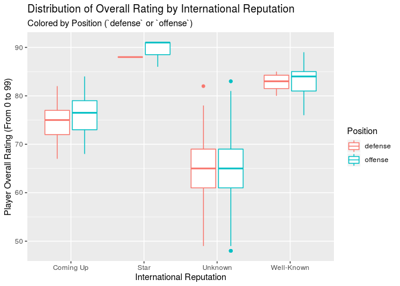
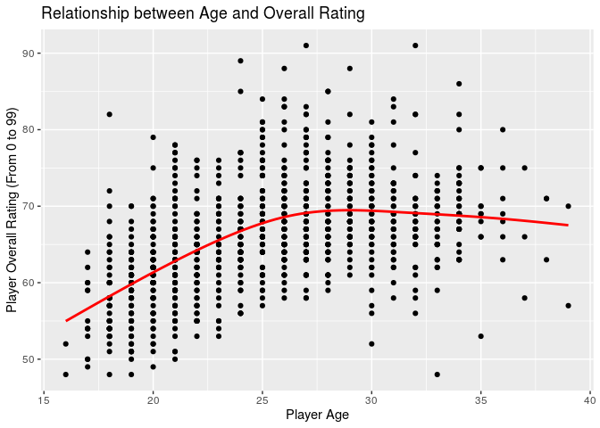
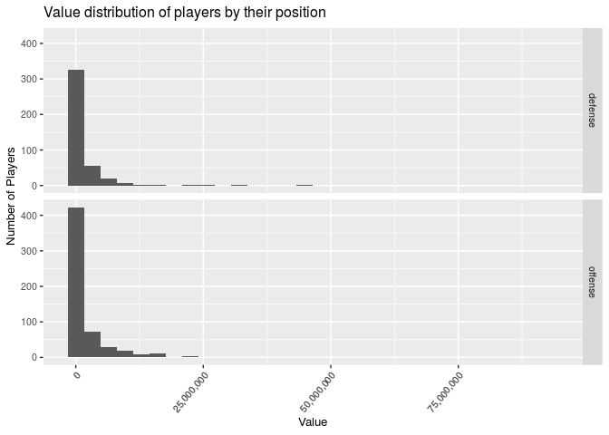
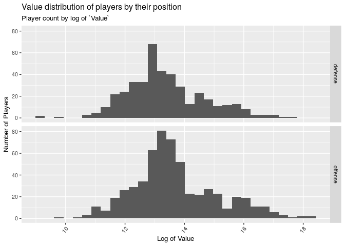
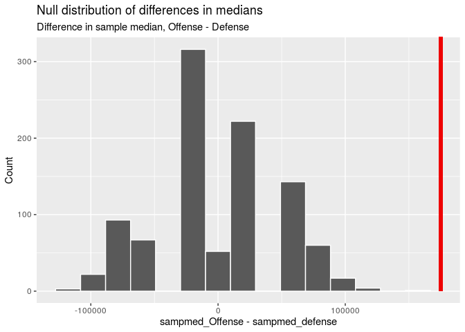
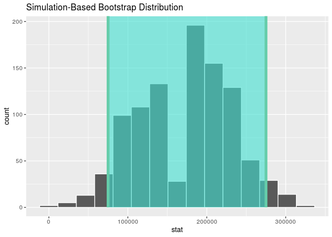
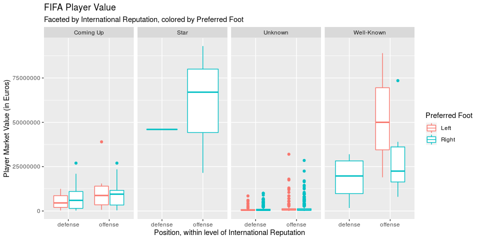

What makes a good FIFA player?
================
SPT Squad
November, 30 2019

### Load packages and data

``` r
library(broom)
library(dplyr)
library(readr)
library(tidyverse)
library(infer)
library(knitr)
```

``` r
fifa <- read_csv("../data/dataWorkingSample.csv")
```

    ## Warning: Missing column names filled in: 'X1' [1]

### Set a seed

``` r
set.seed(1122)
```

### Question One: What are the characteristics that are important in determining a player’s overall rating?

**Dependent variable:** `Overall` (overall rating)  
**Independent variables:** `Age`, `Value`, `Wage`, `International
Reputation`, `Potenial`, `Finishing`, `Preferred Foot`, `Position`  
**Comparison groups:** `Nationality`, `Club`, `Body Type`  
**Hypothesis:** Out of the above independent variables, we expect
`Value`, `Wage`, `International Reputation`, `Potential`, and
`Finishing` to have a statistically significant impact on overall rating
based on our exploratory data analysis.

#### Which method?

We use backwards selection with AIC as our decision criteria in order to
determine our selected model. We selected this statistical method to
answer this question because backwards selection is a good method to
narrow down the appropriate variables for best fitting the data based on
a full model.

#### Recoding `Position`

Before we fit our models, we’ll start with a little bit of data
cleaning. Specifically, we want to re-group individual positions as
either `offense` or `defense` to simplify our analysis:

``` r
fifa_new <- fifa %>%
  mutate(Position = case_when(
    Position %in% c("ST", "LS", "RS", "LM", "RM", "LW", "CF", "RW", "LF", "RF", 
                    "CDM", "LDM", "RDM", "CM", "LCM", "RCM", "CAM", "LAM", 
                    "RAM") ~ "offense",
    Position %in% c("CB", "RCB", "LCB", "RB", "LB", "GK", "LW", "RW", "LWB", 
                    "RWB") ~ "defense"
  ))
```

#### Creating our full model

Our full model is the regression of `Overall` on the independent
variables that we want to investigate. Out of our curiosity, we also
include three interaction terms in the full model: `Age`x`Value`,
`International Reputation`x`Finishing`, and `Value`x`International
Reputation`.

``` r
tidy((m_full <- lm(Overall ~ Age + Value + Wage + 
                     `International Reputation` + Potential + Finishing + 
                      `Preferred Foot` + Position + Age*Value + 
                     `International Reputation`*Finishing +
                     Value*`International Reputation`,
                   data = fifa_new)))
```

    ## # A tibble: 18 x 5
    ##    term                            estimate   std.error statistic   p.value
    ##    <chr>                              <dbl>       <dbl>     <dbl>     <dbl>
    ##  1 (Intercept)                     -7.09e+0     2.00e+0   -3.55   4.05e-  4
    ##  2 Age                              8.42e-1     1.94e-2   43.3    3.47e-230
    ##  3 Value                            4.47e-7     1.34e-7    3.35   8.53e-  4
    ##  4 Wage                             1.82e-5     7.92e-6    2.29   2.20e-  2
    ##  5 `International Reputation`Star   6.47e+0     8.81e+0    0.734  4.63e-  1
    ##  6 `International Reputation`Unkn… -2.59e-1     9.72e-1   -0.266  7.90e-  1
    ##  7 `International Reputation`Well…  4.37e+0     2.04e+0    2.14   3.28e-  2
    ##  8 Potential                        6.97e-1     1.89e-2   36.9    6.37e-188
    ##  9 Finishing                        5.11e-2     1.70e-2    3.01   2.71e-  3
    ## 10 `Preferred Foot`Right            8.07e-3     1.79e-1    0.0451 9.64e-  1
    ## 11 Positionoffense                 -1.44e+0     2.35e-1   -6.14   1.20e-  9
    ## 12 Age:Value                       -6.22e-9     5.42e-9   -1.15   2.52e-  1
    ## 13 `International Reputation`Star… -5.36e-2     1.48e-1   -0.362  7.18e-  1
    ## 14 `International Reputation`Unkn…  2.59e-3     1.69e-2    0.153  8.78e-  1
    ## 15 `International Reputation`Well… -2.91e-2     3.10e-2   -0.940  3.47e-  1
    ## 16 Value:`International Reputatio… -2.82e-7     7.31e-8   -3.86   1.20e-  4
    ## 17 Value:`International Reputatio…  1.52e-7     5.13e-8    2.96   3.12e-  3
    ## 18 Value:`International Reputatio… -2.52e-7     4.83e-8   -5.23   2.10e-  7

#### Finding our selected model with backwards selection

From this full model, we’ll run backwards selection:

``` r
selected_model <- step(m_full, direction = "backward")
```

    ## Start:  AIC=1711.32
    ## Overall ~ Age + Value + Wage + `International Reputation` + Potential + 
    ##     Finishing + `Preferred Foot` + Position + Age * Value + `International Reputation` * 
    ##     Finishing + Value * `International Reputation`
    ## 
    ##                                        Df Sum of Sq     RSS    AIC
    ## - `International Reputation`:Finishing  3       8.2  5348.7 1706.8
    ## - `Preferred Foot`                      1       0.0  5340.5 1709.3
    ## - Age:Value                             1       7.2  5347.7 1710.7
    ## <none>                                               5340.5 1711.3
    ## - Wage                                  1      28.6  5369.1 1714.7
    ## - Position                              1     204.9  5545.4 1747.0
    ## - Value:`International Reputation`      3     496.1  5836.6 1794.2
    ## - Potential                             1    7418.8 12759.3 2580.3
    ## 
    ## Step:  AIC=1706.85
    ## Overall ~ Age + Value + Wage + `International Reputation` + Potential + 
    ##     Finishing + `Preferred Foot` + Position + Age:Value + Value:`International Reputation`
    ## 
    ##                                    Df Sum of Sq     RSS    AIC
    ## - `Preferred Foot`                  1       0.0  5348.7 1704.8
    ## - Age:Value                         1       8.6  5357.3 1706.5
    ## <none>                                           5348.7 1706.8
    ## - Wage                              1      38.8  5387.5 1712.1
    ## - Position                          1     202.2  5550.9 1742.0
    ## - Finishing                         1     374.3  5723.0 1772.5
    ## - Value:`International Reputation`  3     579.1  5927.8 1803.7
    ## - Potential                         1    7499.6 12848.3 2581.2
    ## 
    ## Step:  AIC=1704.85
    ## Overall ~ Age + Value + Wage + `International Reputation` + Potential + 
    ##     Finishing + Position + Age:Value + Value:`International Reputation`
    ## 
    ##                                    Df Sum of Sq     RSS    AIC
    ## - Age:Value                         1       8.6  5357.3 1704.5
    ## <none>                                           5348.7 1704.8
    ## - Wage                              1      38.8  5387.5 1710.1
    ## - Position                          1     203.9  5552.6 1740.3
    ## - Finishing                         1     380.7  5729.4 1771.6
    ## - Value:`International Reputation`  3     579.2  5927.9 1801.7
    ## - Potential                         1    7507.5 12856.2 2579.8
    ## 
    ## Step:  AIC=1704.45
    ## Overall ~ Age + Value + Wage + `International Reputation` + Potential + 
    ##     Finishing + Position + Value:`International Reputation`
    ## 
    ##                                    Df Sum of Sq     RSS    AIC
    ## <none>                                           5357.3 1704.5
    ## - Wage                              1      30.3  5387.6 1708.1
    ## - Position                          1     212.7  5569.9 1741.4
    ## - Finishing                         1     390.1  5747.4 1772.7
    ## - Value:`International Reputation`  3     571.2  5928.4 1799.8
    ## - Potential                         1    7540.6 12897.9 2581.1
    ## - Age                               1   10859.3 16216.6 2810.0

#### Primary conclusions

Based on the results, our hypothesis was partially correct.
Specifically, we were correct about `Value`, `Wage`, `International
Reputation`, `Potential`, and `Finishing` being variables that would be
significant; however, there was one variable that we did not think would
be significant that ended up being significant, `Age`.

The variables that ended up in the selected final model are: `Age`,
`Value`, `International Reputation`, `Potential`, `Finishing`,
`Position`, and `Value`\*`International Reputation`. Therefore, out of
the variables that we were considering at the onset of our analysis
(included in the full model), these final variables are significant in
determining a player’s overall rating. Out of the three interaction
effects we explored in the full model, `Value`x`International
Reputation` was included in the selected model.

The p-values in the selected final model are also worth noting:

``` r
tidy(selected_model) %>% 
  select(term, estimate, p.value) %>% 
  kable(format = "markdown", digits = 7)
```

| term                                       |    estimate |   p.value |
| :----------------------------------------- | ----------: | --------: |
| (Intercept)                                | \-7.1685617 | 0.0000424 |
| Age                                        |   0.8358537 | 0.0000000 |
| Value                                      |   0.0000003 | 0.0000000 |
| Wage                                       |   0.0000163 | 0.0182875 |
| `International Reputation`Star             |   2.1536384 | 0.4512695 |
| `International Reputation`Unknown          | \-0.0965917 | 0.8350958 |
| `International Reputation`Well-Known       |   2.3757426 | 0.0400532 |
| Potential                                  |   0.6981335 | 0.0000000 |
| Finishing                                  |   0.0529045 | 0.0000000 |
| Positionoffense                            | \-1.4496803 | 0.0000000 |
| Value:`International Reputation`Star       | \-0.0000003 | 0.0000016 |
| Value:`International Reputation`Unknown    |   0.0000002 | 0.0022900 |
| Value:`International Reputation`Well-Known | \-0.0000003 | 0.0000001 |

Specifically, a variable like `International Reputation` appears much
more subjective and less rigid in determining – we can see that there
are large fluctuations in the p-values for the different factor levels.
Nonetheless, `International Reputation` still proves an important
characteristic in determining Overall Rating by our AIC backwards model
selection.

#### Visualizations

We might be able to better understand the influence of `International
Reputation` by visualizing it against overall rating:

``` r
fifa_new %>%
  ggplot(aes(x = `International Reputation`, y = Overall, color = Position)) +
  geom_boxplot() +
  labs(x = "International Reputation",
       y = "Player Overall Rating (From 0 to 99)", 
       title = "Distribution of Overall Rating by International Reputation",
       subtitle = "Colored by Position (`defense` or `offense`)") +
  scale_y_continuous(labels = scales::comma)
```

<!-- -->

This boxplot shows us the distribution of players’ overall ratings by
category of international reputation. To reflect the data cleaning we
started with, and in line with our second research question, we further
grouped these plots by `Position`, with red/pink plots reflecting
ratings for defensive players and teal/blue plots reflecting those for
offensive players.

The trends in center across reputation groups is exactly as we’d expect:
highest for international stars, followed by well-known players,
up-and-coming players, and lastly unknown players. Within International
Reputation categories, overall ratings do not seem to vary much between
defensive and offensive positions. The spread of overall ratings is
tightest for Star players; this might be because there are fewer players
in that category, or else because the requirements for a player to be
considered a Star are much more stringent than for the other categories.
Unknown players have the widest spread; they also are the only category
that reflects outliers in this box plot. This makes sense to us: As not
much is known about them on the global stage, unknown players can be
wild cards with a wide range of ability and performance. We would expect
there to be some fantastic players overlooked by the global media
(perhaps playing on mediocre teams, or from a smaller media market). We
would also expect players with a low overall rating to be unknown
internationally – with the worst performance, there’s no reason for them
to be famous.

Let’s also take a look at how age and overall rating are related:

``` r
fifa_new %>%
  ggplot(aes(x = Age, y = Overall)) +
  geom_point() +
  geom_smooth(method = "auto", se = FALSE, colour = "red") +
  labs(x = "Player Age",
       y = "Player Overall Rating (From 0 to 99)", 
       title = "Relationship between Age and Overall Rating") +
  scale_x_continuous(labels = scales::comma) +
  scale_y_continuous(labels = scales::comma)
```

    ## `geom_smooth()` using method = 'gam' and formula 'y ~ s(x, bs = "cs")'

<!-- -->

We used `geom_smooth()`’s `"auto"` method type to visualize this trend,
as we didn’t expect there to be a strictly linear relationship. This
proved accurate: As we can see from the red line, there’s a
mostly-linear, positive relationship between age and overall rating to a
point, then rating appears to level off and slightly decrease as players
age. A player’s rating peak seems to hit at around age 27, after which
age has a slightly negative effect on overall rating. This makes sense
to us\! In general, younger players lack the experience, consistency,
and legacy to earn them higher overall ratings. Similarly, as injuries
and the effects of age accumulate, we would expect the oldest players to
have slightly lower ratings. Lastly, the lowest overall ratings are
mostly consolidated among younger players. We believe this to be because
poor-performing players would leave the league before lasting long
enough to reach comparatively old age, while better players stay in the
game
longer.

### Question Two: Do players who are certain positions have higher market value compared to other positions? More specifically, do offense players have higher market value compared to their counterparts who play defense?

**Dependent variable:** `Value` (market value)  
**Independent variables:** `Position` (all associated dummy variables
because `Position` is a factor variable)  
**Comparison group:** `Club`, `Nationality`, `Preferred Foot`  
**Hypothesis:** If a player’s postition is an offense position, then he
will be traded at a higher market value in comparison to an otherwise
similar player whose position is defensive. This makes sense - the most
heralded players that are paid the most tend to be that score the most
goals (usually offensive players); however, there are some very high
profile defenders and in FIFA as well.

To understand differences across groups – here, `offense` and `defense`
positions – we’ll use hypothesis tests. We’ve already regrouped the
given positions as offense or defense; our code for this is above, under
research question 1. With that out of the way, let’s take a look at how
a player’s market value is distributed by position type.

#### Understanding market value

We’ll start with summary statistics. First, among offensive players:

``` r
options(scipen = 999)

#Offense
fifa_new %>%
  filter(Position == "offense") %>%
  summarize(`Mean` = mean(Value), 
            `Median` = median(Value),
            `Standard Deviation` = sd(Value), 
            `n` = n())
```

    ## # A tibble: 1 x 4
    ##       Mean Median `Standard Deviation`     n
    ##      <dbl>  <dbl>                <dbl> <int>
    ## 1 3078860. 700000             8348831.   579

And next, among defensive players:

``` r
#Defense
fifa_new %>%
  filter(Position == "defense") %>%
  summarize(`Mean` = mean(Value), 
            `Median` = median(Value),
            `Standard Deviation` = sd(Value), 
            `n` = n())
```

    ## # A tibble: 1 x 4
    ##       Mean Median `Standard Deviation`     n
    ##      <dbl>  <dbl>                <dbl> <int>
    ## 1 1765012. 525000             4074874.   421

We’ll continue with a visualization of value distribution by position:

``` r
ggplot(fifa_new, aes(x = Value)) +
  geom_histogram() +
  scale_x_continuous(labels = scales::comma) +
  scale_y_continuous(labels = scales::comma) +
  facet_grid( Position ~ .) +
  theme(text = element_text(size= 10),
        axis.text.x = element_text(angle = 50, hjust = 1)) +
  labs(title = "Value distribution of players by their position", 
       x = "Value", 
       y = "Number of Players")
```

<!-- -->

With players’ values heavily right-skeweed, this is a difficult
visualization to understand. Let’s try again, this time visualizing the
distribution with `log(Value)`:

``` r
ggplot(fifa_new, aes(x = log(Value))) +
  geom_histogram() +
  scale_x_continuous(labels = scales::comma) +
  scale_y_continuous(labels = scales::comma) +
  facet_grid( Position ~ .) +
  theme(text = element_text(size= 10),
        axis.text.x = element_text(angle = 50, hjust = 1)) +
  labs(title = "Value distribution of players by their position", 
       subtitle = "Player count by log of `Value`",
       x = "Log of Value", 
       y = "Number of Players")
```

<!-- -->

This visualization shows us a bit more information – specifically, it
looks like offensive players have generally higher values. We can
confirm this with a hypothesis test. Since the distributions of Value
for both offensive and defensive players are skewed, we’ll compare the
medians.

#### Median Value of Offense \> Median Value of Defense?

**Hypothesis:** Let *median* represent the median Value of players:

H0: *median*Offense - *median*Defense = 0

Ha: *median*Offense - *median*Defense \> 0

**Calculate the observed sample statistic:**

``` r
sampmed_diff <- fifa_new %>%
  specify(Value ~ Position) %>%
  calculate(stat = "diff in medians", order = c("offense", "defense"))

sampmed_diff
```

    ## # A tibble: 1 x 1
    ##     stat
    ##    <dbl>
    ## 1 175000

Using the difference in median value, we have a sample statistic value
of 175000.

We’ll continue by generating and visualizing the null distribution. As
the research question asks for a difference between, we’re looking at an
independence hypothesis. This has us using `"permute"` in our generate
function.

**Permute the null distribution:**

``` r
off_def_perm <- fifa_new %>%
  filter(Position %in% c("offense", "defense")) %>%
  specify(response = Value, explanatory = Position) %>%
  hypothesize(null = "independence") %>%
  generate(reps = 1000, type = "permute") %>%
  calculate(stat = "diff in medians", order = c("offense", "defense"))
```

Let’s visualize the distribution we generated:

``` r
visualize(off_def_perm) +
  labs(title = "Null distribution of differences in medians",
       subtitle = "Difference in sample median, Offense - Defense",
       x = "sampmed_Offense - sampmed_defense",
       y = "Count") +
 shade_p_value(obs_stat = sampmed_diff, direction = "greater")
```

<!-- -->

We shaded the p-value using the “greater” direction, as our calculation
was taken in the order `Offense` - `Defense`, and we’re looking to see
if offensive players have a higher market value than defensive players.
Let’s calculate the p-value to confirm:

**Find the p-value:**

``` r
get_p_value(off_def_perm, sampmed_diff, direction = "greater")
```

    ## # A tibble: 1 x 1
    ##   p_value
    ##     <dbl>
    ## 1       0

#### Primary conclusion

With a p-value smaller than 0.05, we reject the null hypothesis in favor
of the alternative hypothesis. The data provides convincing evidence
that the median market value of offensive players is greater than the
median market value of defensive players.

#### Confidence Interval

Let’s calculate a confidence interval to better understand this
difference in median market value. First, we’ll generate a bootstrap
distribution:

``` r
bootstrap_distribution <- fifa_new %>%
  specify(response = Value, explanatory = Position) %>%
  generate(reps = 1000, type = "bootstrap") %>%
  calculate(stat = "diff in medians", order = c("offense", "defense"))
```

From this distribution, we can calculate our confidence interval:

``` r
ci_bounds <- get_ci(bootstrap_distribution, level = 0.95)
ci_bounds
```

    ## # A tibble: 1 x 2
    ##   `2.5%` `97.5%`
    ##    <dbl>   <dbl>
    ## 1  75000  275000

With this calculation, we are 95% confident that the median Value for
offensive players is between 75,000 and 275,000 Euros higher than that
for defensive players.

Let’s see what this confidence interval looks like in the context of our
bootstrap distribution:

``` r
visualise(bootstrap_distribution) +
  shade_confidence_interval(endpoints = ci_bounds)
```

<!-- -->

Our 95% confidence range is shaded above in teal, with our lower bound
(75000) and our upper bound (275,000) marked with the solid green lines.

#### Putting it all together

Building on what we learned from our earlier visualizations, we’ll use
faceting to better understand the relationship between market value and
position. With this next visualization, we’ll add the context of
international reputation and preferred foot:

``` r
fifa_new %>%
  ggplot(aes(x = Position, y = Value, color = `Preferred Foot`)) +
  geom_boxplot() + 
  facet_grid(. ~ `International Reputation`) + 
  labs(title = "FIFA Player Value",
       subtitle = "Faceted by International Reputation, colored by Preferred Foot",
       x = "Position, within level of International Reputation", 
       y = "Player Market Value (in Euros)")
```

<!-- -->

There’s a lot happening in this visualization. Players are grouped
initially by category of international reputation (as we saw in our
first research question). Within these faceted groups, players are next
grouped by defensive or offensive position. Within these position
groups, the box plots are colored by preferred foot.

Some observations we found interesting: None of the star players
included in our dataset prefer to play with their left foot. As in our
earlier visualizations of international reputation, outliers are much
more heavily present with the `Unknown` category. `Well-Known` and
`Star` players have the widest ranges in market value. For `Coming-Up`
players, looking at the trend in centers shows us that right-footed
players seem to have a slightly higher market value. This is different
among `Well-Known` players; these left-footed players (all offensive)
have a much higher market value than offensive players, by both the
center and spread of the distribution. Player market value by
international rating appears to generally follow the same ordering we
saw in overall rating above: Star, Well-Known, Coming-Up, and Unknown,
though the high density of outliers among Unknown complicates that
generalization relative to Coming-Up players.
