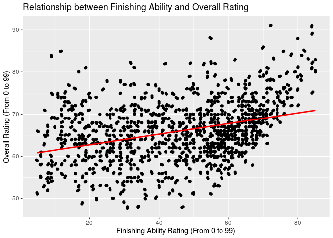

FIFA 19 players
================
SPT Squad
October 25, 2019

### Section 1. Introduction

FIFA, also known as FIFA Soccer or FIFA Football, is a series of soccer
video game simulations released annually by EA Sports. The FIFA series
is listed in the Guinness World Records as the best-selling sports video
game franchise in the world, by 2018, the FIFA series had sold over 260
million copies.

Our particular dataset focuses on the iteration of the game from 2019,
FIFA 19. The dataset is from Kaggle
(<https://www.kaggle.com/karangadiya/fifa19>). It includes detailed
attributes for every registeded player in the game (18,000+). The data
was scraped from a comprehensive online database for FIFA enthusiasts,
<https://sofifa.com/>. Some of the more important variables include:
full name, age, nationality, overall rating (out of 99), club, wage,
dominant foot, international reputation, body type, position, among many
other attributes across players. The benefit of the dataset is that it
is all-encompassing, it has the attributes for every single player in
the game so we are working with a random sample of the entire population
of FIFA players in FIFA 19 (no sampling or response bias), which means
our inference and analysis will be applicable to the entire population
of FIFA players. Additionally, the dataset is very comprehensive: there
are a lot of variables to work with which will give our model stronger
predictive power as well as the ability to fine-tune the independent
variables.

Among the FIFA community, player ratings are a highly debated topic. A
player’s overall rating is the most universal way to measure how good a
player is in FIFA. Soccer players in real life often care about these
ratings too\!

Should Lionel Messi deserve to have a higher rating than Cristiano
Ronaldo? Is Neymar rated too highly given that he is a young player?
With this dataset, we will be able to perform statistical inference on
the characteristics related to a high player rating, as well as compare
players between different groups (teams, nationalities, foot dominance,
etc). We will discuss our specific research questions in section 3 of
this proposal.

### Section 2. Exploratory data analysis

#### Load packages and data

``` r
library(broom)
library(dplyr)
library(readr)
library(tidyverse)
```

``` r
rawdata <- read_csv("../data/data.csv")
```

#### Initial data cleaning

We remove any observations with missing data - some obscure and unknown
players in the game have misisng values for some variables. We believe
that it is appropriate to remove these observations before our random
sampling.

``` r
rawdata <- na.omit(rawdata)
```

We select a simple random sample of 1000 players from our dataset. We
want to make sure our inference can be extrapolated for the population
with a high enough power, so we use a relatively large random sample to
make sure we have enough observations to draw conclusions.

``` r
set.seed(5)
fifa <- sample_n(rawdata, 1000)
```

We clean and change the formatting of two particular variables: `Wage`
and `Value` so that they can be worked with as numbers in our data
analysis as opposed to a string of characters (i.e. ‘€500K’).

``` r
fifa$Value <- substring(fifa$Value, 2)
fifa$Wage <- substring(fifa$Wage, 2)
```

``` r
fifa <- fifa %>%
  mutate(Wage = case_when(
    str_sub(Wage, -1) == "M" ~ (parse_number(Wage)*1000000),
    str_sub(Wage, -1) == "K" ~ (parse_number(Wage)*1000)
  ), Value = case_when(
    str_sub(Value, -1) == "M" ~ (parse_number(Value)*1000000),
    str_sub(Value, -1) == "K" ~ (parse_number(Value)*1000)
  ))
```

#### Univariate analysis

Before we explore relationships between our variables, we visualize and
look at the summary statistics for some of our important variables:
`Overall`, `Potential`, `Age`, `Preferred Foot`, and `International
Reputation`.

``` r
ggplot(fifa, mapping = aes(x = Overall)) +
  geom_histogram(binwidth = 1) +
  labs(title = "Distribution of Overall Player Ratings", 
       x = "Overall Rating (From 0 to 99)", y = "Frequency")
```

<!-- -->

``` r
summarise(fifa, mean = mean(Overall), sd=sd(Overall)) 
```

    ## # A tibble: 1 x 2
    ##    mean    sd
    ##   <dbl> <dbl>
    ## 1  66.0  7.01

The distribution of `Overall` is approximately normal with mean 66.0 and
standard deviation of 7.01. This is to be expected - the game must have
a balance of players with low, medium, and high overall ratings.

``` r
ggplot(fifa, mapping = aes(x = Potential)) +
  geom_histogram(binwidth = 1) +
  labs(title = "Distribution of Potential Player Ratings", 
       x = "Potential Rating (From 0 to 99)", y = "Frequency")
```

<!-- -->

``` r
summarise(fifa, mean = mean(Potential), sd=sd(Potential)) 
```

    ## # A tibble: 1 x 2
    ##    mean    sd
    ##   <dbl> <dbl>
    ## 1  71.0  6.14

The distribution of `Potential` is approximately normal with mean 71.0
and standard deviation of 6.14. It is also worth nothing that the mean
of `Potential` is higher than the mean of `Overall`. This makes sense -
many young players have lower `Overall` ratings but higher `Potential`
ratings, relatively.

``` r
ggplot(fifa, mapping = aes(x = Age)) +
  geom_histogram(binwidth = 1) +
  labs(title = "Distribution of Player Age", 
       x = "Current Age", y = "Frequency") + geom_density()
```

<!-- -->

``` r
summarise(fifa, mean = mean(Age), sd=sd(Age))
```

    ## # A tibble: 1 x 2
    ##    mean    sd
    ##   <dbl> <dbl>
    ## 1  25.3  4.84

The distribution of player ages is relatively symmetric with mean 25.3
and standard deviation 4.84. There are some very young players in our
dataset (younger than 18) and some older players (older than 35).

``` r
ggplot(fifa, mapping = aes(x = `Preferred Foot`)) +
  geom_bar() +
  labs(title = "Frequency of Player Footedness", 
       x = "Preferred Foot", y = "Frequency")
```

<!-- -->

``` r
fifa %>%
  count(`Preferred Foot`) %>%
  mutate(proportion = n/sum(n))
```

    ## # A tibble: 2 x 3
    ##   `Preferred Foot`     n proportion
    ##   <chr>            <int>      <dbl>
    ## 1 Left               226      0.226
    ## 2 Right              774      0.774

Unsurprisingly, the large majority of players prefer their right foot.
Specifically, 22.6% of players in our random sample prefer their left
foot while 77.4% of players in our random sample prefer their right
foot.

``` r
fifa <- fifa %>%
  mutate(`International Reputation` = case_when(
    `International Reputation` == 1 ~ "Unknown",
    `International Reputation` == 2 ~ "Coming Up",
    `International Reputation` == 3 ~ "Well-Known",
    `International Reputation` == 4 ~ "Star",
    `International Reputation` == 5 ~ "Superstar"
  )) %>%
  mutate(`International Reputation`= factor(`International Reputation`,
                                            levels = c(
    "Unknown", "Coming Up", "Well-Known", "Star", "Superstar")))

ggplot(fifa, mapping = aes(x = `International Reputation`)) +
  geom_bar() +
  labs(title = "Frequency of International Reputation", 
       x = "International Reputation", y = "Frequency")
```

<!-- -->

``` r
fifa %>%
  count(`International Reputation`) %>%
  mutate(proportion = n/sum(n))
```

    ## # A tibble: 4 x 3
    ##   `International Reputation`     n proportion
    ##   <fct>                      <int>      <dbl>
    ## 1 Unknown                      916      0.916
    ## 2 Coming Up                     67      0.067
    ## 3 Well-Known                    13      0.013
    ## 4 Star                           4      0.004

From our visualization and relative frequency table, we can see that an
overwhelming majority of the players in our random sample have
`International Reputation` designation of “Unknown” at 91.6%. Only 0.4%
of players in our random sample have “Star” as their designation for
`International Reputation`. Our random sample of 1000 players does not
yield any players that have their `International Reputation` variable
value as “Superstar” as there are only 6 players in the entire dataset
that have this designation.

#### Bivariate analysis

``` r
ggplot(fifa, aes(x = Wage, y = Value)) +
  geom_point() +
  geom_smooth(method = "lm", se = FALSE, colour = "red") +
  labs(x = "Player Wage (in Euros)",
       y = "Player Market Value (in Euros)", 
       title = "Relationship between Wage and Market Value") +
  scale_x_continuous(labels = scales::comma) +
  scale_y_continuous(labels = scales::comma)
```

<!-- -->

Wage is the amount of money that a club will have to pay for a certain
player in FIFA. The market value is the transfer value in which a club
must pay to acquire a player. The amount of money that a player earns in
FIFA should be related to their transfer market value. We observe a
positive relationship - the higher a player’s wage the higher is the
market value. We see that the vast majority of the data is concentrated
in the bottom left of the graph with a few players having much higher
wages and market values.

``` r
ggplot(fifa, aes(x = Finishing, y = Overall)) +
  geom_point() +
  geom_jitter() +
  geom_smooth(method = "lm", se = FALSE, colour = "red") +
  labs(x = "Finishing Ability Rating (From 0 to 99)",
       y = "Overall Rating (From 0 to 99)", 
       title = "Relationship between Finishing Ability and Overall Rating")
```

<!-- -->

The ability for a soccer player in FIFA (and in real life) to finish
around the net is crucial. Therefore, we look at the relationship
between players’ finishing ability (rated from 0 to 99) and their
overall rating (rated from 0 to 99). As expected, we see a positive
relationship between finishing ability and overall rating.

``` r
ggplot(fifa, aes(x = Finishing, y = Value)) +
  geom_point() +
  geom_jitter() +
  geom_smooth(method = "lm", se = FALSE, colour = "red") +
  labs(x = "Finishing Ability Rating (From 0 to 99)",
       y = "Market Value (in Euros)", 
       title = "Relationship between Finishing Ability and Market Value") +
  scale_y_continuous(labels = scales::comma)
```

<!-- -->

Now we look at the relationship between finishing ability and market
value. There is a positive relationship between finishing ability and
market value - those who have higher finishing ability ratings are
expected to have higher market values. It is also worth noting that at
the higher end of finishing ability ratings some players make a lot more
than others with similar finishing ratings. This could be because of
other factors such as `International Reputation` and even the team that
the player plays for.

``` r
ggplot(data = fifa, mapping = aes(x = `Position`, y = `Potential`)) +
  geom_boxplot() +
  labs(x = "Position",
       y = "Potential Rating (From 0 to 99)", 
       title = "Potential Rating by Position")
```

<!-- -->

In this visualization, we use a boxplot to look at players’ potential
rating (from 0 to 99). The potential rating is important to see which
players have a chance to increase their current overall rating. We see
here that players that play the left field position generally have
higher potential ratings compared to other
positions.

``` r
ggplot(data = fifa, mapping = aes(x = `Preferred Foot`, y = `Overall`)) +
  geom_boxplot() + 
  labs(x = "Preferred Foot",
       y = "Overall Rating (From 0 to 99)", 
       title = "Overall Rating by Foot Preference")
```

<!-- -->

Many of the most famous and talented FIFA players are left-footed, such
as Lionel Messi and Arjen Robben. In this visualization, we want to
compare overall ratings by foot preference. The visualization shows that
left-footed and right-footed players are very similar when it comes to
overall rating.

``` r
ggplot(data = fifa, mapping = aes(x = `International Reputation`,
                                  y = `Overall`)) +
  geom_boxplot() +
  labs(x = "International Reputation",
       y = "Overall Rating (From 0 to 99)", 
       title = "Overall Rating by International Reputation")
```

<!-- -->

In this visualizaiton we explore overall rating by international
reputation. The results are what we expected - those who have “Star”
designation have the highest overall rating.

Based on our findings in the exploratory data analysis, we are ready to
explore the research questions we would like to answer and what factors
will be important in answering the
questions.

### Section 3. Research questions

#### Question 1: What are the characteristics that have a statistically significant impact on a player’s overall rating?

**Dependent variable:** `Overall` (overall rating) **Independent
variables:** `Age`, `Value`, `Wage`, `International Reputation`,
`Potenial`, `Finishing`, `Preferred Foot`, `Position` **Comparison
groups:** `Nationality`, `Club`, `Body Type` **Hypothesis:** Out of the
above independent variables, we expect `Value`, `Wage`, `International
Reputation`, `Potential`, and `Finishing` to have a statistically
significant impact on overall rating based on our exploratory data
analysis.

#### Question Two: Do players who are certain positions have higher market value compared to other positions? More specifically, do strikers have higher market value compared to their counterparts who play other positions?

**Dependent variable:** `Value` (market value) **Independent
variables:** `Position` (all associated dummy variables because
`Position` is a factor variable) **Comparison group:** `Club`,
`Nationality`, `Preferred Foot` **Hypothesis:** If a player’s postition
is striker, then he will be traded at a higher market value in
comparison to an otherwise similar player whose position is not striker.
This makes sense - the most heralded players that are paid the most tend
to be that score the most goals (usually strikers); however, there are
some very high profile defenders in FIFA as well.

### Section 4. Data

We provide glimpses of the overall dataset as well as the random sample
of 1000 observations that we will be working with.

``` r
glimpse(rawdata) 
```

    ## Observations: 16,643
    ## Variables: 56
    ## $ ID                         <dbl> 0, 1, 2, 3, 4, 5, 6, 7, 8, 9, 10, 11,…
    ## $ Name                       <chr> "L. Messi", "Cristiano Ronaldo", "Ney…
    ## $ Age                        <dbl> 31, 33, 26, 27, 27, 27, 32, 31, 32, 2…
    ## $ Nationality                <chr> "Argentina", "Portugal", "Brazil", "S…
    ## $ Overall                    <dbl> 94, 94, 92, 91, 91, 91, 91, 91, 91, 9…
    ## $ Potential                  <dbl> 94, 94, 93, 93, 92, 91, 91, 91, 91, 9…
    ## $ Club                       <chr> "FC Barcelona", "Juventus", "Paris Sa…
    ## $ Value                      <chr> "€110.5M", "€77M", "€118.5M", "€72M",…
    ## $ Wage                       <chr> "€565K", "€405K", "€290K", "€260K", "…
    ## $ Special                    <dbl> 2202, 2228, 2143, 1471, 2281, 2142, 2…
    ## $ `Preferred Foot`           <chr> "Left", "Right", "Right", "Right", "R…
    ## $ `International Reputation` <dbl> 5, 5, 5, 4, 4, 4, 4, 5, 4, 3, 4, 4, 3…
    ## $ `Weak Foot`                <dbl> 4, 4, 5, 3, 5, 4, 4, 4, 3, 3, 4, 5, 3…
    ## $ `Skill Moves`              <dbl> 4, 5, 5, 1, 4, 4, 4, 3, 3, 1, 4, 3, 2…
    ## $ `Work Rate`                <chr> "Medium/ Medium", "High/ Low", "High/…
    ## $ `Body Type`                <chr> "Messi", "C. Ronaldo", "Neymar", "Lea…
    ## $ Position                   <chr> "RF", "ST", "LW", "GK", "RCM", "LF", …
    ## $ `Jersey Number`            <dbl> 10, 7, 10, 1, 7, 10, 10, 9, 15, 1, 9,…
    ## $ Joined                     <chr> "1-Jul-04", "10-Jul-18", "3-Aug-17", …
    ## $ Height                     <chr> "5'7", "6'2", "5'9", "6'4", "5'11", "…
    ## $ Weight                     <chr> "159lbs", "183lbs", "150lbs", "168lbs…
    ## $ Crossing                   <dbl> 84, 84, 79, 17, 93, 81, 86, 77, 66, 1…
    ## $ Finishing                  <dbl> 95, 94, 87, 13, 82, 84, 72, 93, 60, 1…
    ## $ HeadingAccuracy            <dbl> 70, 89, 62, 21, 55, 61, 55, 77, 91, 1…
    ## $ ShortPassing               <dbl> 90, 81, 84, 50, 92, 89, 93, 82, 78, 2…
    ## $ Volleys                    <dbl> 86, 87, 84, 13, 82, 80, 76, 88, 66, 1…
    ## $ Dribbling                  <dbl> 97, 88, 96, 18, 86, 95, 90, 87, 63, 1…
    ## $ Curve                      <dbl> 93, 81, 88, 21, 85, 83, 85, 86, 74, 1…
    ## $ FKAccuracy                 <dbl> 94, 76, 87, 19, 83, 79, 78, 84, 72, 1…
    ## $ LongPassing                <dbl> 87, 77, 78, 51, 91, 83, 88, 64, 77, 2…
    ## $ BallControl                <dbl> 96, 94, 95, 42, 91, 94, 93, 90, 84, 1…
    ## $ Acceleration               <dbl> 91, 89, 94, 57, 78, 94, 80, 86, 76, 4…
    ## $ SprintSpeed                <dbl> 86, 91, 90, 58, 76, 88, 72, 75, 75, 6…
    ## $ Agility                    <dbl> 91, 87, 96, 60, 79, 95, 93, 82, 78, 6…
    ## $ Reactions                  <dbl> 95, 96, 94, 90, 91, 90, 90, 92, 85, 8…
    ## $ Balance                    <dbl> 95, 70, 84, 43, 77, 94, 94, 83, 66, 4…
    ## $ ShotPower                  <dbl> 85, 95, 80, 31, 91, 82, 79, 86, 79, 2…
    ## $ Jumping                    <dbl> 68, 95, 61, 67, 63, 56, 68, 69, 93, 7…
    ## $ Stamina                    <dbl> 72, 88, 81, 43, 90, 83, 89, 90, 84, 4…
    ## $ Strength                   <dbl> 59, 79, 49, 64, 75, 66, 58, 83, 83, 7…
    ## $ LongShots                  <dbl> 94, 93, 82, 12, 91, 80, 82, 85, 59, 1…
    ## $ Aggression                 <dbl> 48, 63, 56, 38, 76, 54, 62, 87, 88, 3…
    ## $ Interceptions              <dbl> 22, 29, 36, 30, 61, 41, 83, 41, 90, 1…
    ## $ Positioning                <dbl> 94, 95, 89, 12, 87, 87, 79, 92, 60, 1…
    ## $ Vision                     <dbl> 94, 82, 87, 68, 94, 89, 92, 84, 63, 7…
    ## $ Penalties                  <dbl> 75, 85, 81, 40, 79, 86, 82, 85, 75, 1…
    ## $ Composure                  <dbl> 96, 95, 94, 68, 88, 91, 84, 85, 82, 7…
    ## $ Marking                    <dbl> 33, 28, 27, 15, 68, 34, 60, 62, 87, 2…
    ## $ StandingTackle             <dbl> 28, 31, 24, 21, 58, 27, 76, 45, 92, 1…
    ## $ SlidingTackle              <dbl> 26, 23, 33, 13, 51, 22, 73, 38, 91, 1…
    ## $ GKDiving                   <dbl> 6, 7, 9, 90, 15, 11, 13, 27, 11, 86, …
    ## $ GKHandling                 <dbl> 11, 11, 9, 85, 13, 12, 9, 25, 8, 92, …
    ## $ GKKicking                  <dbl> 15, 15, 15, 87, 5, 6, 7, 31, 9, 78, 1…
    ## $ GKPositioning              <dbl> 14, 14, 15, 88, 10, 8, 14, 33, 7, 88,…
    ## $ GKReflexes                 <dbl> 8, 11, 11, 94, 13, 8, 9, 37, 11, 89, …
    ## $ `Release Clause`           <chr> "€226.5M", "€127.1M", "€228.1M", "€13…

``` r
glimpse(fifa)
```

    ## Observations: 1,000
    ## Variables: 56
    ## $ ID                         <dbl> 14490, 13431, 7588, 14550, 1971, 8011…
    ## $ Name                       <chr> "J. Bocanegra", "E. Torres", "A. Maun…
    ## $ Age                        <dbl> 19, 20, 27, 21, 29, 28, 34, 27, 33, 2…
    ## $ Nationality                <chr> "Colombia", "Mexico", "United States"…
    ## $ Overall                    <dbl> 61, 62, 68, 61, 75, 67, 71, 61, 72, 5…
    ## $ Potential                  <dbl> 74, 72, 69, 73, 75, 68, 71, 61, 72, 6…
    ## $ Club                       <chr> "Junior FC", "Guadalajara", "Vancouve…
    ## $ Value                      <dbl> 475000, 500000, 850000, 350000, 65000…
    ## $ Wage                       <dbl> 1000, 5000, 3000, 1000, 47000, 2000, …
    ## $ Special                    <dbl> 1477, 1479, 1524, 894, 1729, 1473, 17…
    ## $ `Preferred Foot`           <chr> "Left", "Left", "Right", "Right", "Ri…
    ## $ `International Reputation` <fct> Unknown, Unknown, Unknown, Unknown, U…
    ## $ `Weak Foot`                <dbl> 3, 3, 3, 1, 3, 3, 3, 3, 3, 3, 3, 3, 3…
    ## $ `Skill Moves`              <dbl> 3, 2, 2, 1, 2, 2, 2, 2, 2, 2, 3, 2, 3…
    ## $ `Work Rate`                <chr> "High/ Medium", "Medium/ Medium", "Me…
    ## $ `Body Type`                <chr> "Normal", "Lean", "Lean", "Lean", "St…
    ## $ Position                   <chr> "LM", "RM", "CB", "GK", "ST", "RCB", …
    ## $ `Jersey Number`            <dbl> 16, 99, 22, 12, 20, 4, 4, 24, 4, 24, …
    ## $ Joined                     <chr> "1-Jan-18", "1-Jul-16", "11-Aug-17", …
    ## $ Height                     <chr> "5'7", "5'5", "6'1", "6'2", "6'3", "6…
    ## $ Weight                     <chr> "165lbs", "121lbs", "185lbs", "168lbs…
    ## $ Crossing                   <dbl> 61, 60, 25, 11, 42, 28, 48, 26, 52, 3…
    ## $ Finishing                  <dbl> 52, 60, 39, 6, 74, 26, 51, 19, 43, 32…
    ## $ HeadingAccuracy            <dbl> 31, 43, 68, 11, 84, 61, 73, 64, 66, 4…
    ## $ ShortPassing               <dbl> 56, 64, 62, 27, 71, 64, 72, 42, 72, 5…
    ## $ Volleys                    <dbl> 45, 48, 26, 7, 70, 33, 29, 24, 37, 35…
    ## $ Dribbling                  <dbl> 70, 68, 51, 12, 64, 38, 59, 33, 56, 4…
    ## $ Curve                      <dbl> 53, 54, 42, 14, 46, 24, 25, 18, 56, 3…
    ## $ FKAccuracy                 <dbl> 57, 39, 27, 10, 29, 20, 54, 24, 45, 4…
    ## $ LongPassing                <dbl> 46, 60, 52, 27, 59, 60, 69, 32, 67, 5…
    ## $ BallControl                <dbl> 63, 62, 60, 14, 73, 55, 65, 44, 66, 5…
    ## $ Acceleration               <dbl> 69, 76, 48, 25, 48, 53, 45, 73, 45, 6…
    ## $ SprintSpeed                <dbl> 75, 73, 63, 27, 58, 50, 48, 69, 51, 6…
    ## $ Agility                    <dbl> 73, 72, 34, 31, 35, 61, 52, 60, 65, 7…
    ## $ Reactions                  <dbl> 58, 55, 68, 55, 73, 62, 75, 62, 68, 5…
    ## $ Balance                    <dbl> 68, 78, 38, 32, 48, 56, 67, 54, 70, 7…
    ## $ ShotPower                  <dbl> 52, 60, 59, 22, 80, 50, 48, 43, 54, 4…
    ## $ Jumping                    <dbl> 46, 42, 71, 48, 69, 72, 71, 83, 69, 7…
    ## $ Stamina                    <dbl> 54, 41, 68, 18, 69, 62, 72, 64, 83, 6…
    ## $ Strength                   <dbl> 61, 29, 73, 52, 90, 78, 84, 78, 70, 6…
    ## $ LongShots                  <dbl> 35, 46, 42, 5, 64, 33, 65, 18, 44, 36…
    ## $ Aggression                 <dbl> 31, 32, 74, 17, 77, 73, 85, 64, 88, 6…
    ## $ Interceptions              <dbl> 32, 24, 67, 15, 32, 64, 68, 57, 72, 5…
    ## $ Positioning                <dbl> 53, 51, 42, 8, 78, 43, 43, 22, 59, 40…
    ## $ Vision                     <dbl> 52, 53, 54, 42, 65, 42, 64, 22, 70, 5…
    ## $ Penalties                  <dbl> 53, 61, 32, 13, 62, 25, 59, 29, 47, 4…
    ## $ Composure                  <dbl> 63, 51, 53, 51, 68, 68, 69, 60, 68, 5…
    ## $ Marking                    <dbl> 25, 17, 67, 23, 35, 65, 62, 50, 66, 5…
    ## $ StandingTackle             <dbl> 28, 29, 69, 11, 46, 66, 69, 61, 73, 5…
    ## $ SlidingTackle              <dbl> 23, 29, 60, 13, 38, 62, 63, 58, 65, 5…
    ## $ GKDiving                   <dbl> 11, 10, 9, 60, 7, 6, 9, 14, 10, 9, 8,…
    ## $ GKHandling                 <dbl> 15, 13, 7, 62, 16, 10, 10, 8, 16, 9, …
    ## $ GKKicking                  <dbl> 8, 10, 7, 57, 6, 16, 12, 8, 15, 5, 13…
    ## $ GKPositioning              <dbl> 6, 9, 14, 58, 9, 9, 6, 9, 15, 10, 12,…
    ## $ GKReflexes                 <dbl> 15, 11, 6, 61, 12, 6, 8, 11, 12, 11, …
    ## $ `Release Clause`           <chr> "€962K", "€950K", "€1.3M", "€613K", "…

``` r
write.csv(fifa,'dataWorkingSample.csv')
```
