FIFA 19 Final Write-Up
================
SPT Squad
December 13, 2019

<!-- ====================== Packages and data cleaning ===================== -->

<!-- Load packages -->

<!-- Load, filter, and clean data -->

<!-- ============================== Write-Up ============================== -->

# Introduction

<!-- Is the research question, motivation for the analysis, and data clearly 
described? -->

FIFA, also known as FIFA Soccer or FIFA Football, is a series of soccer
video game simulations released annually by EA Sports. The FIFA series
is listed in the Guinness World Records as the best-selling sports video
game franchise in the world, by 2018, the FIFA series had sold over 260
million copies.

Among the FIFA community, player ratings are a highly debated topic. A
player’s overall rating is the most universal way to measure how good a
player is in FIFA. Soccer players in real life often care about these
ratings too\!

Should Lionel Messi deserve to have a higher rating than Cristiano
Ronaldo? Is Neymar rated too highly given that he is a young player? Are
offensive players worth more in the transfer market compared to
defensive players? Through our final project, we perform statistical
inference on the characteristics related to a high player rating, as
well as compare players between different groups (position, foot
dominance, etc). Our specific research questions are identified later in
this analysis.

## Dataset

Our particular dataset focuses on the iteration of the game from 2019,
FIFA 19. The dataset is from
[Kaggle](https://www.kaggle.com/karangadiya/fifa19). It includes
detailed attributes for every registeded player in the game (18,000+).
The data was scraped from a comprehensive online database for FIFA
enthusiasts, <https://sofifa.com/>. Some of the more important variables
include: full name, age, nationality, overall rating (out of 99), club,
wage, dominant foot, international reputation, body type, position,
among many other attributes across players. The benefit of the dataset
is that it is all-encompassing, it has the attributes for every single
player in the game so we are working with a random sample of the entire
population of FIFA players in FIFA 19 (no sampling or response bias),
which means our inference and analysis will be applicable to the entire
population of FIFA players. Additionally, the dataset is very
comprehensive: there are a lot of variables to work with which will give
our model stronger predictive power as well as the ability to fine-tune
the independent
variables.

## Univariate Analysis

<!-- Are univariate distributions in the data clearly visualized and described 
using the appropriate summary statistics? -->

Before we explore relationships between our variables, we visualize and
look at the summary statistics for some of our important variables:
`Overall`, `Potential`, `Age`, `Preferred Foot`, and `International
Reputation`.

#### Overall Player Rating

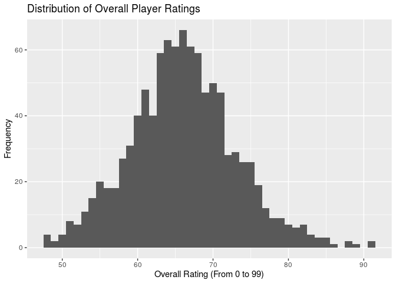<!-- -->

The distribution of `Overall` is approximately normal, with a mean of
66.02 and standard deviation of 7.01. This is to be expected – the game
must have a balance of players with low, medium, and high overall
ratings.

#### Player Potential

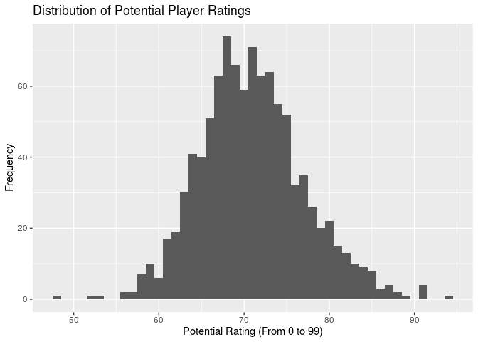<!-- -->

The distribution of `Potential` is also approximately normal; its mean
is 70.96 and its standard deviation is 6.14. It is worth nothing that
the mean of `Potential` is higher than the mean of `Overall.` This makes
sense to us – many young players have lower `Overall` ratings but higher
`Potential` ratings, relatively.

#### Player Age

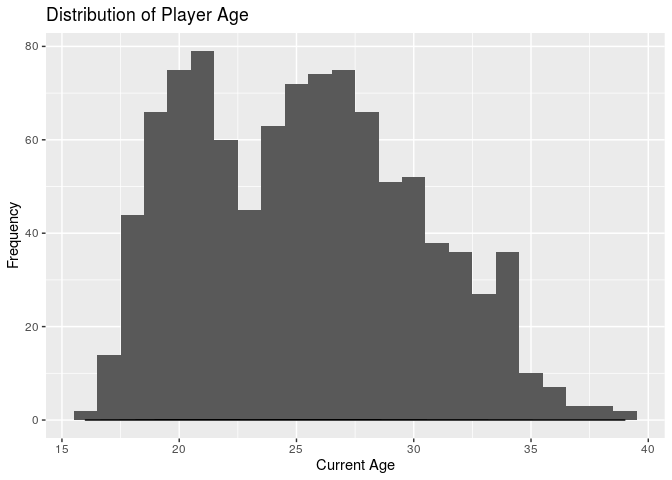<!-- -->

The distribution of player ages is relatively symmetric, with mean 25.3
and standard deviation 4.84. There are some very young players in our
dataset (younger than 18) and some older players (older than 35).

#### Player Preferred Foot

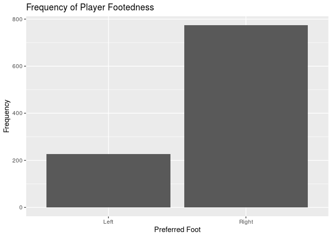<!-- -->

Unsurprisingly, the large majority of players prefer their right foot.
Specifically, 22.6% of players in our random sample prefer their left
foot while 77.4% of players in our random sample prefer their right
foot.

#### Player International Reputation

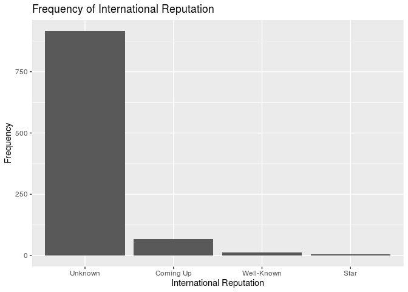<!-- -->

From our visualization and a calculated relative frequencies, we can see
that an overwhelming majority of the players in our random sample
(91.6%) have the `International Reputation` designation of “Unknown”.
Only 0.4% of players in our random sample have “Star” as their
designation for `International Reputation`. Our random sample of 1000
players does not yield any players that have the `International
Reputation` value of “Superstar” – this isn’t too surprising to us, as
there are only 6 players in the entire dataset who have this
designation.

## Bivariate/Multivariate Analysis

<!-- Are relevant and interesting bivariate/multivariate relationships 
clearly visualized and described using the appropriate summary statistics? -->

We’ll explore the following variables and relationships through our
bivariate analysis: `Value` vs. `Wage`, `Overall` vs. `Finishing`,
`Value` vs. `Finishing`, `Potential` vs. `Position`, `Overall` vs.
`Preferred Foot`, and `Overall` vs. `International Reputation`.

#### Market Value and Player Compensation

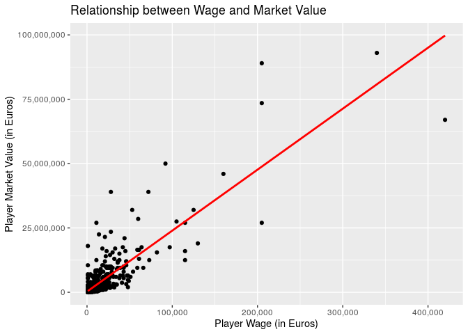<!-- -->

Wage is the amount of money that a club will have to pay for a certain
player in FIFA. The market value is the transfer value in which a club
must pay to acquire a player. The amount of money that a player earns in
FIFA should be related to their transfer market value. We observe a
positive relationship – the higher a player’s wage, the higher their
market value. We see that the vast majority of the data is concentrated
in the bottom left of the graph, with a few players having much higher
wages and market values.

#### Finishing Ability and Overall Player Rating

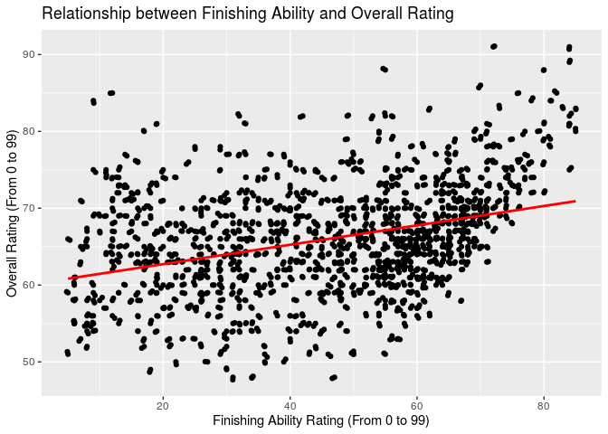<!-- -->

The ability for a soccer player in FIFA (and in real life) to finish
around the net is crucial. Therefore, we look at the relationship
between players’ finishing ability (rated from 0 to 99) and their
overall rating (rated from 0 to 99). As expected, we see a positive
relationship between finishing ability and overall rating.

#### Finishing Ability and Market Value

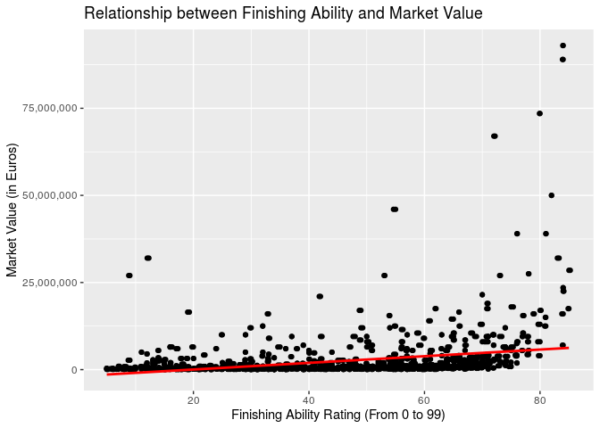<!-- -->

Now we look at the relationship between finishing ability and market
value. There is a positive relationship between finishing ability and
market value - those who have higher finishing ability ratings are
expected to have higher market values. It is also worth noting that at
the higher end of finishing ability ratings some players make a lot more
than others with similar finishing ratings. This could be because of
other factors such as `International Reputation` or even the team that
the player plays for.

#### Position and Potential Rating

<!-- -->

In this visualization, we use a boxplot to look at players’ potential
rating (from 0 to 99). The potential rating is important to see which
players have a chance to increase their current overall rating. We see
here that players that play the left field position generally have
higher potential ratings compared to other positions.

#### Foot Preference and Overall Rating

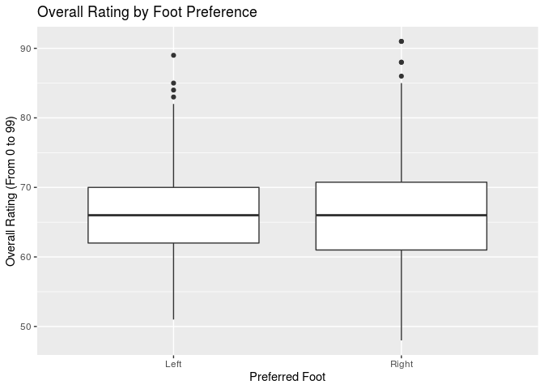<!-- -->

Many of the most famous and talented FIFA players are left-footed, such
as Lionel Messi and Arjen Robben. In this visualization, we want to
compare overall ratings by foot preference. The visualization shows that
left-footed and right-footed players are very similar when it comes to
overall rating.

#### International Reputation and Overall Rating

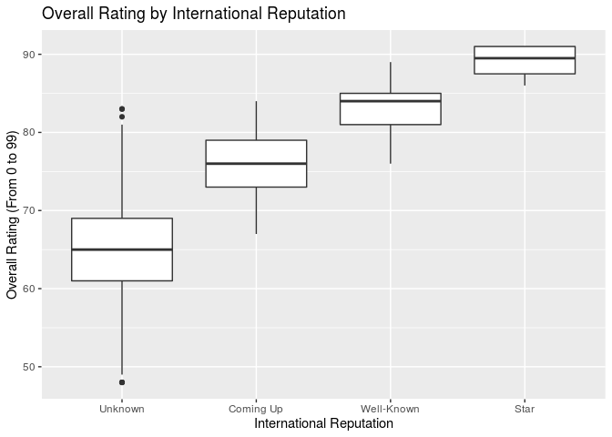<!-- -->

In this visualizaiton we explore overall rating by international
reputation. The results are what we expected - those who have “Star”
designation have the highest overall rating.

With these findings from our univariate and bivariate analyses, we’re
ready to explore our research
questions.

# Research Questions, Data Analysis & Results

<!-- To include from data analysis write-up -->

## Question One: What are the characteristics that are important in determining a player’s overall rating?

**Dependent variable:** `Overall` (overall rating)  
**Independent variables:** `Age`, `Value`, `Wage`, `International
Reputation`, `Potenial`, `Finishing`, `Preferred Foot`, `Position`  
**Comparison groups:** `Nationality`, `Club`, `Body Type`  
**Hypothesis:** Out of the above independent variables, we expect
`Value`, `Wage`, `International Reputation`, `Potential`, and
`Finishing` to have a statistically significant impact on overall rating
based on our exploratory data analysis.

#### Which method?

We use backwards selection with AIC as our decision criteria in order to
determine our selected model. We selected this statistical method to
answer this question because backwards selection is a good method to
narrow down the appropriate variables for best fitting the data based on
a full model.

#### Recoding `Position`

Before we fit our models, we’ll start with a little bit of data
cleaning. Specifically, we want to re-group individual positions as
either `offense` or `defense` to simplify our analysis:

#### Creating our full model

Our full model is the regression of `Overall` on the independent
variables that we want to investigate. Out of our curiosity, we also
include three interaction terms in the full model: `Age*Value`,
`International Reputation*Finishing`, and `Value*International
Reputation`.

    ## # A tibble: 18 x 5
    ##    term                            estimate   std.error statistic   p.value
    ##    <chr>                              <dbl>       <dbl>     <dbl>     <dbl>
    ##  1 (Intercept)                     -7.09e+0     2.00e+0   -3.55   4.05e-  4
    ##  2 Age                              8.42e-1     1.94e-2   43.3    3.47e-230
    ##  3 Value                            4.47e-7     1.34e-7    3.35   8.53e-  4
    ##  4 Wage                             1.82e-5     7.92e-6    2.29   2.20e-  2
    ##  5 `International Reputation`Star   6.47e+0     8.81e+0    0.734  4.63e-  1
    ##  6 `International Reputation`Unkn… -2.59e-1     9.72e-1   -0.266  7.90e-  1
    ##  7 `International Reputation`Well…  4.37e+0     2.04e+0    2.14   3.28e-  2
    ##  8 Potential                        6.97e-1     1.89e-2   36.9    6.37e-188
    ##  9 Finishing                        5.11e-2     1.70e-2    3.01   2.71e-  3
    ## 10 `Preferred Foot`Right            8.07e-3     1.79e-1    0.0451 9.64e-  1
    ## 11 Positionoffense                 -1.44e+0     2.35e-1   -6.14   1.20e-  9
    ## 12 Age:Value                       -6.22e-9     5.42e-9   -1.15   2.52e-  1
    ## 13 `International Reputation`Star… -5.36e-2     1.48e-1   -0.362  7.18e-  1
    ## 14 `International Reputation`Unkn…  2.59e-3     1.69e-2    0.153  8.78e-  1
    ## 15 `International Reputation`Well… -2.91e-2     3.10e-2   -0.940  3.47e-  1
    ## 16 Value:`International Reputatio… -2.82e-7     7.31e-8   -3.86   1.20e-  4
    ## 17 Value:`International Reputatio…  1.52e-7     5.13e-8    2.96   3.12e-  3
    ## 18 Value:`International Reputatio… -2.52e-7     4.83e-8   -5.23   2.10e-  7

#### Finding our selected model with backwards selection

From this full model, we’ll run backwards selection:

    ## Start:  AIC=1711.32
    ## Overall ~ Age + Value + Wage + `International Reputation` + Potential + 
    ##     Finishing + `Preferred Foot` + Position + Age * Value + `International Reputation` * 
    ##     Finishing + Value * `International Reputation`
    ## 
    ##                                        Df Sum of Sq     RSS    AIC
    ## - `International Reputation`:Finishing  3       8.2  5348.7 1706.8
    ## - `Preferred Foot`                      1       0.0  5340.5 1709.3
    ## - Age:Value                             1       7.2  5347.7 1710.7
    ## <none>                                               5340.5 1711.3
    ## - Wage                                  1      28.6  5369.1 1714.7
    ## - Position                              1     204.9  5545.4 1747.0
    ## - Value:`International Reputation`      3     496.1  5836.6 1794.2
    ## - Potential                             1    7418.8 12759.3 2580.3
    ## 
    ## Step:  AIC=1706.85
    ## Overall ~ Age + Value + Wage + `International Reputation` + Potential + 
    ##     Finishing + `Preferred Foot` + Position + Age:Value + Value:`International Reputation`
    ## 
    ##                                    Df Sum of Sq     RSS    AIC
    ## - `Preferred Foot`                  1       0.0  5348.7 1704.8
    ## - Age:Value                         1       8.6  5357.3 1706.5
    ## <none>                                           5348.7 1706.8
    ## - Wage                              1      38.8  5387.5 1712.1
    ## - Position                          1     202.2  5550.9 1742.0
    ## - Finishing                         1     374.3  5723.0 1772.5
    ## - Value:`International Reputation`  3     579.1  5927.8 1803.7
    ## - Potential                         1    7499.6 12848.3 2581.2
    ## 
    ## Step:  AIC=1704.85
    ## Overall ~ Age + Value + Wage + `International Reputation` + Potential + 
    ##     Finishing + Position + Age:Value + Value:`International Reputation`
    ## 
    ##                                    Df Sum of Sq     RSS    AIC
    ## - Age:Value                         1       8.6  5357.3 1704.5
    ## <none>                                           5348.7 1704.8
    ## - Wage                              1      38.8  5387.5 1710.1
    ## - Position                          1     203.9  5552.6 1740.3
    ## - Finishing                         1     380.7  5729.4 1771.6
    ## - Value:`International Reputation`  3     579.2  5927.9 1801.7
    ## - Potential                         1    7507.5 12856.2 2579.8
    ## 
    ## Step:  AIC=1704.45
    ## Overall ~ Age + Value + Wage + `International Reputation` + Potential + 
    ##     Finishing + Position + Value:`International Reputation`
    ## 
    ##                                    Df Sum of Sq     RSS    AIC
    ## <none>                                           5357.3 1704.5
    ## - Wage                              1      30.3  5387.6 1708.1
    ## - Position                          1     212.7  5569.9 1741.4
    ## - Finishing                         1     390.1  5747.4 1772.7
    ## - Value:`International Reputation`  3     571.2  5928.4 1799.8
    ## - Potential                         1    7540.6 12897.9 2581.1
    ## - Age                               1   10859.3 16216.6 2810.0

#### Primary conclusions

Based on the results, our hypothesis was partially correct.
Specifically, we were correct about `Value`, `Wage`, `International
Reputation`, `Potential`, and `Finishing` being variables that would be
significant; however, there was one variable that we did not think would
be significant that ended up being significant, `Age`.

The variables that ended up in the selected final model are: `Age`,
`Value`, `International Reputation`, `Potential`, `Finishing`,
`Position`, and `Value*International Reputation`. Therefore, out of the
variables that we were considering at the onset of our analysis
(included in the full model), these final variables are significant in
determining a player’s overall rating. Out of the three interaction
effects we explored in the full model, `Value*International Reputation`
was included in the selected model.

The p-values in the selected final model are also worth noting:

| term                                       |    estimate |   p.value |
| :----------------------------------------- | ----------: | --------: |
| (Intercept)                                | \-7.1685617 | 0.0000424 |
| Age                                        |   0.8358537 | 0.0000000 |
| Value                                      |   0.0000003 | 0.0000000 |
| Wage                                       |   0.0000163 | 0.0182875 |
| `International Reputation`Star             |   2.1536384 | 0.4512695 |
| `International Reputation`Unknown          | \-0.0965917 | 0.8350958 |
| `International Reputation`Well-Known       |   2.3757426 | 0.0400532 |
| Potential                                  |   0.6981335 | 0.0000000 |
| Finishing                                  |   0.0529045 | 0.0000000 |
| Positionoffense                            | \-1.4496803 | 0.0000000 |
| Value:`International Reputation`Star       | \-0.0000003 | 0.0000016 |
| Value:`International Reputation`Unknown    |   0.0000002 | 0.0022900 |
| Value:`International Reputation`Well-Known | \-0.0000003 | 0.0000001 |

Specifically, a variable like `International Reputation` appears much
more subjective and less rigid in determining – we can see that there
are large fluctuations in the p-values for the different factor levels.
Nonetheless, `International Reputation` still proves an important
characteristic in determining Overall Rating by our AIC backwards model
selection.

#### Visualizations

We might be able to better understand the influence of `International
Reputation` by visualizing it against overall rating:

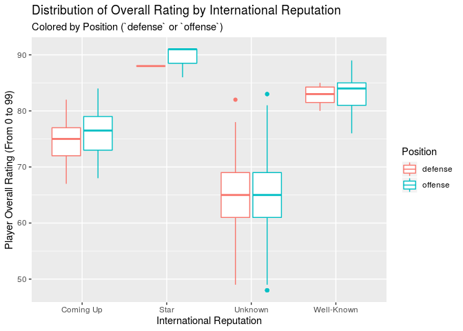<!-- -->

This boxplot shows us the distributions of players’ overall ratings by
category of international reputation. To reflect the data cleaning we
started with, and in line with our second research question, we further
grouped these plots by `Position`, with red/pink plots reflecting
ratings for defensive players and teal/blue plots reflecting those for
offensive players.

The trends in center across reputation groups is exactly as we’d expect:
highest for international stars, followed by well-known players,
up-and-coming players, and lastly unknown players. Within International
Reputation categories, overall ratings do not seem to vary much between
defensive and offensive positions. The spread of overall ratings is
tightest for Star players; this might be because there are fewer players
in that category, or else because the requirements for a player to be
considered a Star are much more stringent than for the other categories.
Unknown players have the widest spread; they also are the only category
that reflects outliers in this box plot. This makes sense to us: As not
much is known about them on the global stage, unknown players can be
wild cards with a wide range of ability and performance. We would expect
there to be some fantastic players overlooked by the global media
(perhaps playing on mediocre teams, or from a smaller media market). We
would also expect players with a low overall rating to be unknown
internationally – with the worst performance, there’s no reason for them
to be famous.

Let’s also take a look at how age and overall rating are related:

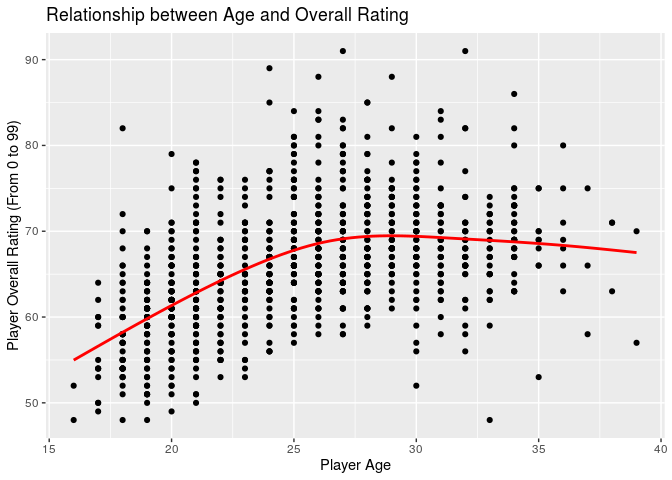<!-- -->

We used `geom_smooth()`’s `"auto"` method type to visualize this trend,
as we didn’t expect there to be a strictly linear relationship. This
proved accurate: As we can see from the red line, there’s a
mostly-linear, positive relationship between age and overall rating to a
point, then rating appears to level off and slightly decrease as players
age. A player’s rating peak seems to hit at around age 27, after which
age has a slightly negative effect on overall rating. This makes sense
to us\! In general, younger players lack the experience, consistency,
and legacy to earn them higher overall ratings. Similarly, as injuries
and the effects of age accumulate, we would expect the oldest players to
have slightly lower ratings. Lastly, the lowest overall ratings are
mostly consolidated among younger players. We believe this to be because
poor-performing players would leave the league before lasting long
enough to reach comparatively old age, while better players stay in the
game
longer.

## Question Two: Do players who are certain positions have higher market value compared to other positions? More specifically, do offense players have higher market value compared to their counterparts who play defense?

**Dependent variable:** `Value` (market value)  
**Independent variables:** `Position` (all associated dummy variables
because `Position` is a factor variable)  
**Comparison group:** `Club`, `Nationality`, `Preferred Foot`  
**Hypothesis:** If a player’s postition is an offense position, then he
will be traded at a higher market value in comparison to an otherwise
similar player whose position is defensive. This makes sense - the most
heralded players that are paid the most tend to be that score the most
goals (usually offensive players); however, there are some very high
profile defenders and in FIFA as well.

To understand differences across groups – here, `offense` and `defense`
positions – we’ll use hypothesis tests. We’ve already regrouped the
given positions as offense or defense; our code for this is above, under
research question 1. With that out of the way, let’s take a look at how
a player’s market value is distributed by position type.

#### Understanding market value

We’ll start with summary statistics. First, among offensive players:

    ## # A tibble: 1 x 4
    ##       Mean Median `Standard Deviation`     n
    ##      <dbl>  <dbl>                <dbl> <int>
    ## 1 3078860. 700000             8348831.   579

And next, among defensive players:

    ## # A tibble: 1 x 4
    ##       Mean Median `Standard Deviation`     n
    ##      <dbl>  <dbl>                <dbl> <int>
    ## 1 1765012. 525000             4074874.   421

We’ll continue with a visualization of value distribution by position:

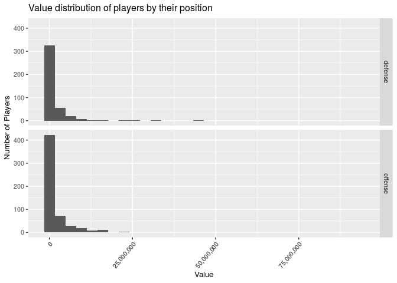<!-- -->

With players’ values heavily right-skewed, this is a difficult
visualization to understand. Let’s try again, this time visualizing the
distribution with `log(Value)`:

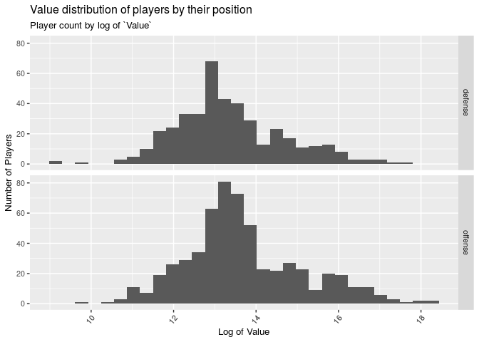<!-- -->

This visualization shows us a bit more information – specifically, it
looks like offensive players have generally higher values. We can
confirm this with a hypothesis test. Since the distributions of Value
for both offensive and defensive players are skewed, we’ll compare the
medians.

#### Median Value of Offense \> Median Value of Defense?

**Hypothesis:** Let *median* represent the median Value of players:

H0: *median*Offense - *median*Defense = 0

Ha: *median*Offense - *median*Defense \> 0

**Calculate the observed sample statistic:**

    ## # A tibble: 1 x 1
    ##     stat
    ##    <dbl>
    ## 1 175000

Using the difference in median value, we have a sample statistic value
of 175000.

We’ll continue by generating and visualizing the null distribution. As
the research question asks for a difference between, we’re looking at an
independence hypothesis. This has us using `"permute"` in our generate
function.

**Permute the null distribution:**

Let’s visualize the distribution we generated:

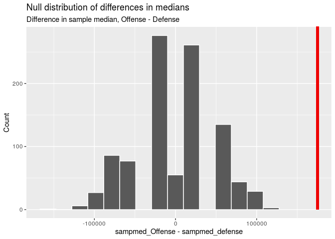<!-- -->

We shaded the p-value using the “greater” direction, as our calculation
was taken in the order `Offense` - `Defense`, and we’re looking to see
if offensive players have a higher market value than defensive players.
Let’s calculate the p-value to confirm:

**Find the p-value:**

    ## # A tibble: 1 x 1
    ##   p_value
    ##     <dbl>
    ## 1       0

#### Primary conclusion

With a p-value smaller than 0.05, we reject the null hypothesis in favor
of the alternative hypothesis. The data provides convincing evidence
that the median market value of offensive players is greater than the
median market value of defensive players.

Our hypothesis was indeed correct - we hypothesized that players who
play offense would have a higher transfer `Value` when compared to
players who play defense. As discussed before, our intuition was that
the players who score the most goals (typically offense players) should
be worth the most in the transfer market. We did not hypothesize how
much higher offense player `Value` would be compared to defense player
`Value`. In the following portion of this analysis, we will construct a
confidence interval to better understand the difference in median
`Value` for offense and defense players.

#### Confidence Interval

First, we’ll generate a bootstrap distribution. Then using this
distribution, we calculate our confidence interval:

    ## # A tibble: 1 x 2
    ##   `2.5%` `97.5%`
    ##    <dbl>   <dbl>
    ## 1  75000  275000

With this calculation, we are 95% confident that the median `Value` for
offensive players is between 75,000 and 275,000 Euros higher than that
for defensive players.

Let’s see what this confidence interval looks like in the context of our
bootstrap distribution:

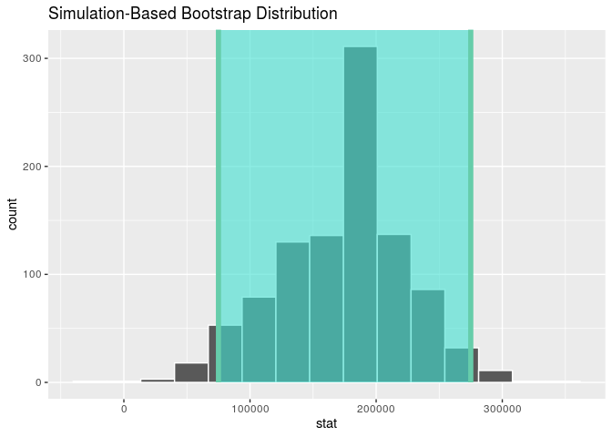<!-- -->

Our 95% confidence range is shaded above in teal, with our lower bound
(75000) and our upper bound (275,000) marked with the solid green lines.

#### Putting it all together

Building on what we learned from our earlier visualizations, we’ll use
faceting to better understand the relationship between market value and
position. With this next visualization, we’ll add the context of
international reputation and preferred foot:

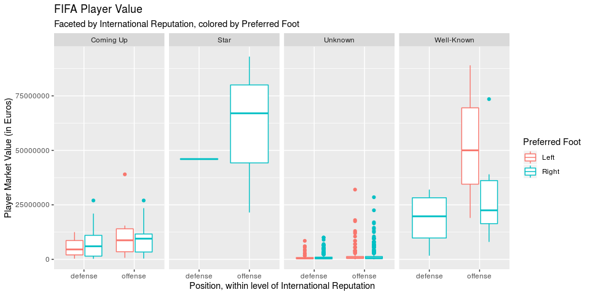<!-- -->

There’s a lot happening in this visualization. Players are grouped
initially by category of international reputation (as we saw in our
first research question). Within these faceted groups, players are next
grouped by defensive or offensive position. Within these position
groups, the box plots are colored by preferred foot.

Some observations we found interesting: None of the star players
included in our dataset prefer to play with their left foot. As in our
earlier visualizations of international reputation, outliers are much
more heavily present with the `Unknown` category. `Well-Known` and
`Star` players have the widest ranges in market value. For `Coming-Up`
players, looking at the trend in centers shows us that right-footed
players seem to have a slightly higher market value. This is different
among `Well-Known` players; these left-footed players (all offensive)
have a much higher market value than offensive players, by both the
center and spread of the distribution. Player market value by
international rating appears to generally follow the same ordering we
saw in overall rating above: Star, Well-Known, Coming-Up, and Unknown,
though the high density of outliers among Unknown complicates that
generalization relative to Coming-Up
players.

# Conclusion

<!-- One to two pages -->

## Research Questions

<!-- for each, a summary on what we've learned about our research question and statistical arguments supporting our conclusions. Start with EDA!-->

#### Question One: What are the characteristics that are important in determining a player’s overall rating?

The exploratory data analysis was a crucial step of the analysis and
construction of our methodology in tackling Question One. We analyzed a
vareity of different visualizations to narrow down which variables we
want to include as part of our full model to be narrowed down through
backwards selection. We learned as a group that understanding the
dataset that you are working with and performing a thorough exploratory
data analysis before jumping into inference is good practice.

As we have noted in the above section, the variables that ended up in
the selected final model are: `Age`, `Value`, `International
Reputation`, `Potential`, `Finishing`, `Position`, and
`Value`X`International Reputation`. Now we have a much better idea what
causes a FIFA player to have a certain rating, and we can even predict
what a FIFA player’s overall rating might be given values for these
independent variables\!

Let’s evaluate the predictive power of our selected model using
R-Squared and see how backwards selection performed:

    ## [1] 0.8908297

The R-Squared is .8908, which means that roughly 89.08% of the
variability in overall rating can be explained the covariates in our
selected model. This is quite high - which is a result of careful
initial data analysis, initial variable selection for the full model, as
well as the ability of the backwards selection method to select the
best-fitting model using the variables from the full model. Backwards
model selection is a useful tool to use when determining apprporiate
regression models and narrowing down a list of independent variables.
Some limitations of this method will be discussed in the Criqitues and
Limitations portion of the conclusion. Nonetheless, we will definitely
continue to use this tool in the rest of our data science
careers.

#### Question Two: Do players who are certain positions have higher market value compared to other positions? More specifically, do offense players have higher market value compared to their counterparts who play defense?

Again, our exploratory data analysis pointed us in the right direction
to flesh out this research question. Specifically, we observed that the
distribution of Value was heavily skewed; therefore, instead of using
the CLT and analyzing the mean Values for offensive and defensive
players, we analyzed the medians. If we had not looked at these
visualizations and used the group means instead, our results would be
biased. Skipping an initial data analysis will negatively impact the
rest of one’s analysis\!

As stated in the above section, we determined that offensive players do
indeed have a higher Value in the trasfer market when compared to
defensive players. We then went on to construct a confidence interval
that says that we are 95% confident that the median Value for offensive
players is between 75,000 and 275,000 Euros higher than that for
defensive players.

In constructing and researching confidence intervals, we also learned an
important caveat in terms of their interpretation. We are careful to say
that we are “95% confident” instead of there being a “95% probability”.
This is because we have already observed the data after the confidence
interval is constructed, there is nothing random in our interval. We had
wondered why it is correct to say “95% confident” instead of “95%
probability” and now we have much more clarity about
it.

## Critiques, Limitations, and Future Work

<!-- critique your own methods and provide suggestions for improving your analysis. Issues pertaining to the reliability and validity of your data and appropriateness of the statistical analysis should also be discussed here. include a paragraph on what you would do differently if you were able to start over with the project or what you would do next if you were going to continue work on the project -->

For the ease of the project and due to the difference in our group
members’ computers’ computing powers, we decided to work with a random
sample of players from the population of players of size 1000. This
project is a very rare example of a time when statisticians have data
for an entire population to perform statistical analysis on - and the
most robust and correct form of analysis would feature analysis
performed on the entire population. While a sample size of 1000 is more
than large enough to perform sound statistical analysis, all of our
tests would be more robust with the entire population (or even a larger
sample size). Additionally, a downfall of random sampling is that there
is no guarantee that the data is reflective of the population on
average. There were 6 very high-profile players that were given the
International Superstar designation in the `International Reputation`
variable; however, our simple random sample did not capture any of them
(which makes sense but we were interested in seeing how these
high-profile players would impact our analysis). On the other hand,
because we did have the entire population at our disposal and took a
random sample, there was no selection bias.

As highlighted above, for Question One, our selected model has quite
strong predictive power with an R-Squared value of .8908. However, the
R-Squared value does not determine whether the coefficient estimates and
predictions are biased, so it is always good practice to look at
residual plots. It is possible for a biased model to have high
R-Squared\!

Let’s take a look at a residuals plot against one of our independent
variables, `Age`:

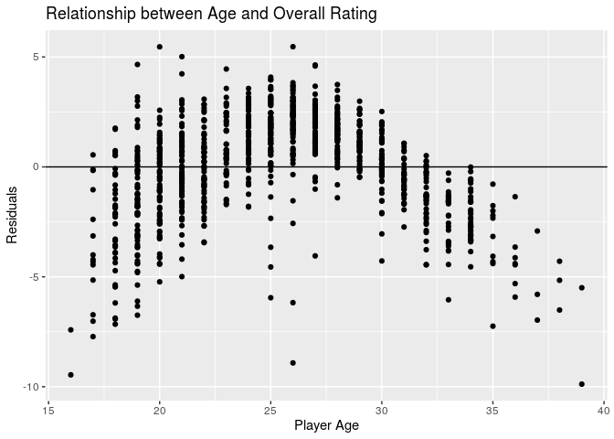<!-- -->

An unbiased model has residuals that are randomly scattered around 0.
Our residuals are not randomly scattered around 0, but rather follow
some sort of pattern - this is not good and a limitation of our
analysis. One of the assumptions of a least-squared regression is
homoscedastic residuals (residuals are drawn from a population with
constant variance); however, as we can see from our residuals plot our
residuals are heteroscedastic, which signals that our model may indeed
be biased. Additionally, this is only the residual plot for the
residuals against one of our independent variables\!

If we were to continue working with this project, we would indeed
analyze the residual plots for all our independent variables and then go
about rectifying the possible heteroscedasticy either through building
and testing different models (potentially median regression) or testing
different transformations such as log transformations. While backwards
model selection is a good method to find models with low AIC and high
R-Squared, there are clearly limitations to this method. Using solely
R-Squared to determine how good a model is is not good statistical
practice. Selecting and fine-tuning new regression models would be a
worthwhile next step for our project.
